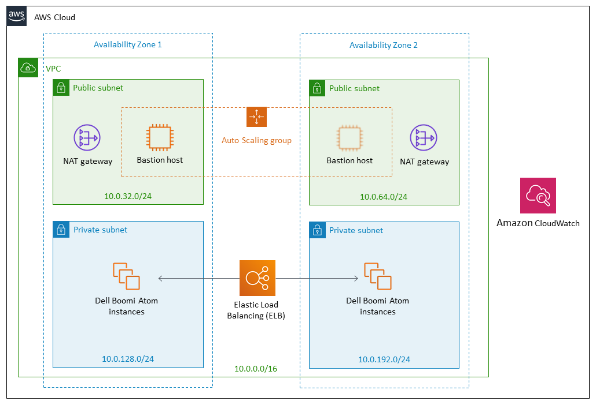

Deploying this Quick Start for a new virtual private cloud (VPC) with
default parameters builds the following _{partner-product-short-name}_ environment in the
AWS Cloud.

// Replace this example diagram with your own. Send us your source PowerPoint file. Be sure to follow our guidelines here : http://(we should include these points on our contributors giude)
[#architecture1]
.Quick Start architecture for _{partner-product-short-name}_ on AWS
[link=images/architecture_diagram.png]

As shown in Figure 1, the Quick Start sets up the following:

* A VPC configured with public and private subnets according to AWS best
practices, to provide you with your own virtual network on AWS*
* In the public subnets, managed NAT gateways to allow outbound internet
access for resources in the private subnets*
* In the public subnets, a Linux bastion host in an Auto Scaling group
to allow inbound Secure Shell (SSH) access to Amazon Elastic Compute
Cloud (Amazon EC2) instances in public and private subnets
* In the private subnets, a Boomi Atom instance
* Atom instances running Amazon Linux 2
* Cloudwatch alarm for auto-recovery in case of instance failure

Please note: Due to limitations of using single-use installation tokens, Atom instances created from this quickstart are not part of auto scale groups or load balancers. If you have a need for high availability Atoms, please look into deployment of Boomi Molecule. A Boomi Molecule Quickstart is available at https://aws.amazon.com/quickstart/architecture/dell-boomi-molecule/.
