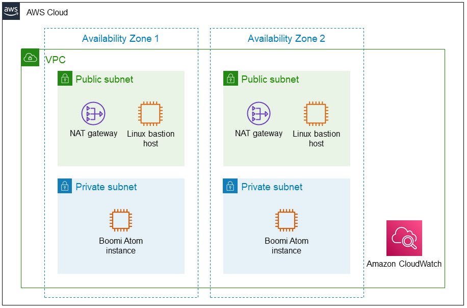

Deploying this Quick Start into a new VPC with default parameters builds the following {partner-product-short-name} environment in the AWS Cloud.

// Replace this example diagram with your own. Send us your source PowerPoint file. Be sure to follow our guidelines here : http://(we should include these points on our contributors giude)
:xrefstyle: short
[#architecture1]
.Quick Start architecture for {partner-product-short-name} on AWS
[link=images/architecture_diagram.png]

As shown in <<architecture1>>, the Quick Start sets up the following:

* A highly available architecture that spans two Availability Zones.
* A VPC configured with public and private subnets according to AWS best practices, to provide you with your own virtual network on AWS.
* In the public subnets:
** A managed network address translation (NAT) gateway to allow outbound internet access for resources in the private subnets.
** A Linux bastion host to allow inbound Secure Shell (SSH) access to Amazon EC2 instances in public and private subnets.
* In the private subnets, a Dell Boomi Atom installed on an Amazon EC2 instance running Amazon Linux 2.
* An Amazon CloudWatch alarm for instance recovery if there is a failure.

NOTE: Because of the limitations of single-use installation tokens, this Quick Start does not deploy Auto Scaling groups or load balancers. To deploy highly available Boomi Atom instances with multiple nodes and load balancing, consider deploying https://aws.amazon.com/quickstart/architecture/dell-boomi-molecule/[Boomi Molecule on AWS^].